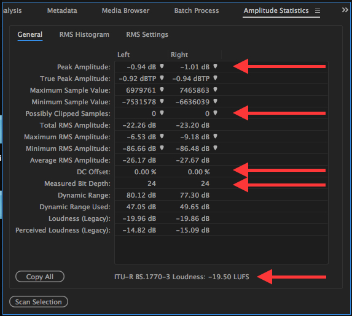

## Manual, Item-level Audio Quality Control Workflow

### Overview
The following workflow describes the manual, item-level workflow for Quality Control of the Himan Brown audio collection.  

For this workflow, you will need access to:  

* the asset's Filemaker record    
* the asset's photo documentation  
* the asset's preservation master(s)  
* the asset's presentaion (access) master  
* Adobe Audition CC, or comparable digital audio workstation

The Digital Audio Workstation (DAW) illustrations in the following workflow description have been taken from Adobe Audition CC, 10.1.1.11 

### Workflow

1)	For each asset, compare its FileMaker record, photo documentation, Audio Preservation Master files, and the Presentation (access) Master file.  Assure that the following are appropriate and consistent:  
* Title  
* Date  
* Sequence (relevant for the .tifs and Audio Preservation Master files only)  
* File naming convention  
  

2)	Load the first Audio Preservation Master file into Adobe Audition.  Using Audition's Waveform editor, generate Amplitude Statistics for the file.  

---

*Example: amplitude statistics with some relavent QC data highlighted*  

---  

3)	Inspect the audio waveform, both visually and by playing back approximately thirty seconds from the head, middle and tail of the file.  

Durring the inspection, confirm that the following aspects of the file's **program content** are consistant and appropriate:  

* that the program content has not been cut short  
* that the program content has no unexpected break in continuity  
* that the program content is consistent with the data gathered in Step 1[see above] of this workflow.

Durring the inspection, confirm that the following **technical and production characteristics** are consistant and appropriate.  Supplement the visual and playback inspection by using the DAW's signal analysis meters and the Amplitude Statistics generated in step 2 (above).  Confirm that the following are appropriate:  

* Speed  
* Playback direction  
* Channel balance  
* Cross-talk  
* De-emphasis (EQ)  
* File functionality  
* Phase    
* Correlation  
* Soundfield   
* Clipped samples  
* DC offset  
* Loudness 
* Distortion

---
*Example:  audio waveform*  

---
4)	Repeat steps 2-4 with any of the asset’s remaining Audio Preservation Master files, as needed.    
	
5)	When all of the asset’s Audio Preservation Master files have been checked, load the asset’s Audio Presentation Master file into the workstation.  Repeat the procedure described in steps 2-4 of this workflow on the Audio Presentation Master file. Addtionaly, confirm that:      
* the program content of the Audio Presentation Master is consistent with the program content of its corresponding Audio Preservation Master file(s).  
* any reconstruction of the asset (file-joins, cross fades, level matching, etc.) made in the Presentation Master from multiple Preservation Master files is appropriate.

