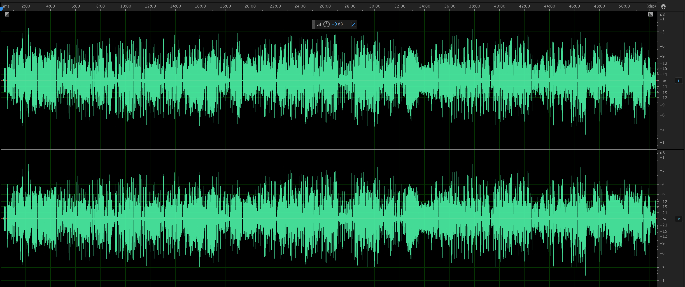

## Item-level Manual Quality Control Workflow for the Himan Brown Audio Collection

The following workflow describes the non-automated, item-level workflow for manual Quality Control of the Himan Brown audio collection.

The Digital Audio Workstation illustrations in the following workflow description have been taken from Adobe Audition CC, 10.1.1.11 

### Workflow

1.	For each asset, compare its FileMaker record, .tif files, Audio Preservation Master files, and the Presentation Master file.  Assure that the following are appropriate and consistent:  
•	Title  
•	Date  
•	Sequence (.tifs and Audio Preservation Master files only)  
•	File naming convention  
  

2.	Load the first Audio Preservation Master file into Adobe Audition.  Using Audition's Waveform editor view, generate Amplitude statistics for the Audio Preservation Master file.    
Amplitude statistics.  

! [Amplitude statistics](qc_1.jpg)

1.	Inspect the audio waveform, both visually and by playing back approximately thirty seconds from the head, middle and tail of the file.  Assure that the following aspects of the program are appropriate and confirm that:  
•	the program content has not been cut short  
•	the program content has no break in continuity  
•	the program content is consistent with the data gathered in step one[see above]  

4.	Inspect the audio file both visually and by playing back approximately thirty seconds from the head, middle and tail of the file, as well as with signal analysis meters, and the amplitude statistics generated in step 2 above.   Assure that the following technical and production characteristics are consistant and appropriate:  
•	Speed  
•	Playback direction  
•	Channel balance  
•	Cross-talk  
•	De-emphasis (EQ)  
•	File functionality  
•	Phase    
•	Correlation  
•	Soundfield   
•	Clipped samples  
•	DC offset  
•	Loudness  

5.	Repeat steps 2-4 with any of the asset’s remaining Audio Preservation Master files, as needed.    
	
6.	When all of the asset’s Audio Preservation Master files have been checked, load the asset’s Audio Presentation Master file into the workstation.  Repeat steps 2-4 of this workflow on the Audio Presentation Master file. Addtionaly, confirm that:      
•	the program content of the Audio Presentation Master is consistent with the program content of its corresponding Audio Preservation Master file(s).  
•	any reconstruction of the asset (file-joins, cross fades, level matching, etc.) made in the Presentation Master from multiple Preservation Master files is appropriate.

